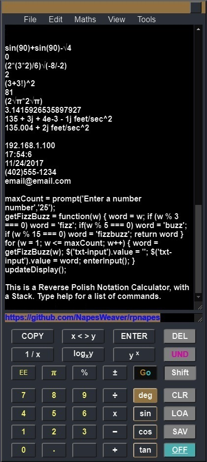
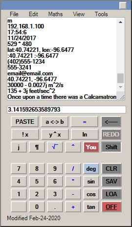
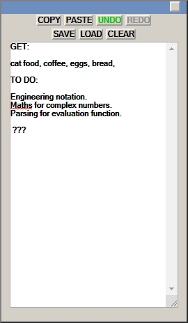
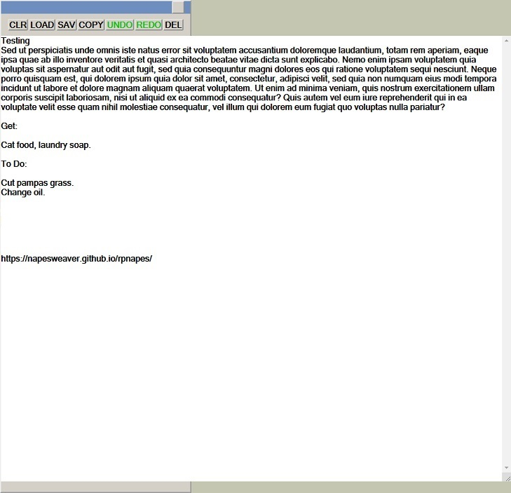
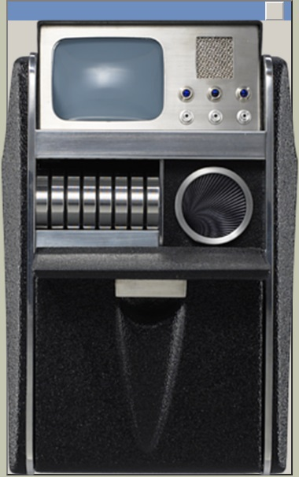

# RPNapes

<!-- [Reverse Polish notation calcamatron](https://napesweaver.github.io/rpnapes/) -->
<a href="https://napesweaver.github.io/rpnapes/" target="_blank">Reverse Polish notation calcamatron</a>

## Calcamatron

My first and favorite JS project - much of the code still needs refactoring.

Created with engineering calculators like the HP 48 in mind, this calamatron is programmable with a command line interface. It operates using reverse Polish notation and algebraically. RPN complex maths have been implemented using the [math.js](https://mathjs.org/) library. The UI makes use of a visible, interactive, stack that can be saved, using cookies for persistent storage. Unit labeling is supported. Saving/loading files are supported thanks to Eli Grey's [FileSaver.js](https://github.com/eligrey/FileSaver.js/).

The project does not use any jQuery and Works offline. Some effort has been made to keep it compatible for backwardly browsers.

Example JavaScript snippet:

`maxCount = prompt('Enter a number number','25');`

`getFizzBuzz = function(w){ word = w;if (w % 3 === 0) word = 'fizz'; if(w % 5 === 0) word = 'buzz'; if (w % 15 === 0) word = 'fizzbuzz'; return word}`

`for(w = 1; w <= maxCount; w++){ word=getFizzBuzz(w); $('txt-input').value=''; $('txt-input').value=word; enterInput(); }`

## Notes
A separate interface for note taking is also implemented.

Thanks to [Mathjs.org](https://mathjs.org/) for the math.js library. Made implementing complex maths and formatting with engineering notation easy!

Opening and saving text files is supported thanks to Eli Grey's [FileSaver.js](https://github.com/eligrey/FileSaver.js/).

Public IP address are obtained thanks to the [IPify](https://www.ipify.org/) Public IP Address API.

Darryl Snow's [moveCursorToEnd](https://gist.github.com/darryl-snow/3990793) function saved the day in my attempts to wrangle with mobile keypads.

The [stopwatch](https://tinloof.com/blog/how-to-build-a-stopwatch-with-html-css-js-react-part-2/) tutorial by Omar Benseddik made including that feature (and timer) too tempting.

## Tricorder

The tricorder doesn't do much. It only exists because I wanted to map some buttons to an image and, also, I wanted to see a tricorder on my phone ;) It displays a weather forecast and weather map, from [darksky.net/forecast](https://darksky.net/forecast) and [maps.darksky.net](https://maps.darksky.net) There are also a few [Shoutcast](https://directory.shoutcast.com/) Internet radio stations and YouTube videos embedded in iFrames. Maybe some other useful links too.

The original tricorder image can be found on [IMGBIN](https://imgbin.com/png/7Ay8HnU3/medical-tricorder-star-trek-x-prize-foundation-hypospray-png). Thanks to keiske84.